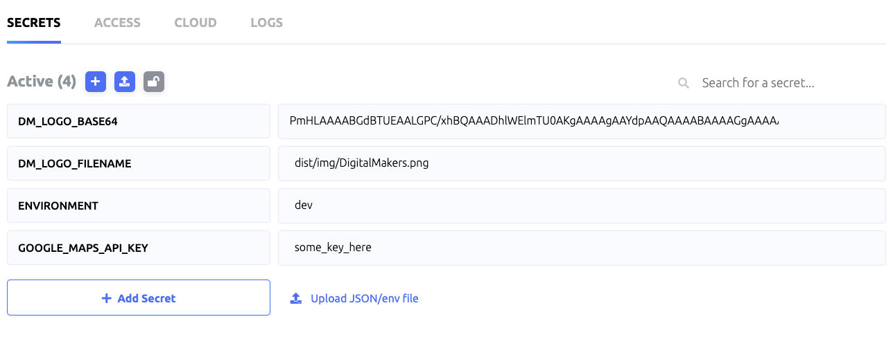

# OVERVIEW

Use a doppler.com service token to prepare a build or release pipeline in Azure DevOps.

To install this in your organisation in Azure DevOps, head over here:
[https://marketplace.visualstudio.com/items?itemName=DigitalMakers.dm-azure-doppler]

## BASIC SETUP

Set up some secrets in your Doppler.com account. I've added some helper code to convert base64 encoded secrets into files,
so if you suffix a key with _BASE64 and then also add the same with _FILENAME, it will decode into that file path.

For example, if you did something like this, when run it would make a file in ./dist/img called DigitalMakers.png

Other than that, the options should be pretty easy to understand.

No guarantees or SLA's given, use at own risk, yada yada yada. Enjoy!

